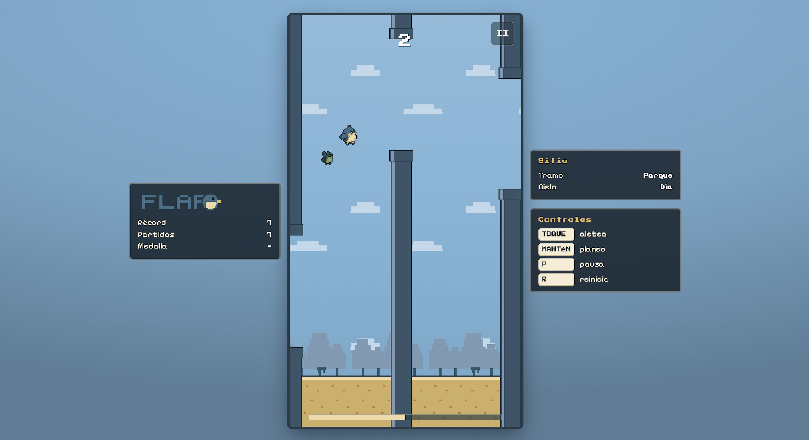

<div align="center">

# FLAPO

**El hermano gordito del pájaro famoso: toca para aletear, mantén para planear y cruza tuberías sin tocar nada.**

[](https://rldona.github.io/flapo/)
[](https://github.com/rldona/flapo/actions/workflows/ci.yml)
[](https://github.com/rldona/flapo/actions/workflows/pages.yml)
[](LICENSE)
[](https://github.com/rldona/flapo/commits/main)
[](https://github.com/rldona/flapo)
[](https://github.com/rldona/flapo)

[](https://github.com/rldona/flapo/stargazers)
[](https://github.com/rldona/flapo/network/members)
[](https://github.com/rldona/flapo/issues)
[](#contribuir)


</div>



## Índice

- [Demo](#demo)
- [Qué es](#qué-es)
- [Características](#características)
- [Cómo jugar](#cómo-jugar)
- [Controles](#controles)
- [Mecánicas](#mecánicas)
  - [Aliento y planeo](#aliento-y-planeo)
  - [Fatiga](#fatiga)
  - [Frutas](#frutas)
  - [Curva de dificultad](#curva-de-dificultad)
  - [Variantes de tubería](#variantes-de-tubería)
  - [Ráfagas de viento](#ráfagas-de-viento)
  - [Escenarios y tramos del viaje](#escenarios-y-tramos-del-viaje)
- [Modos y progresión](#modos-y-progresión)
- [Reto del día y semilla compartible](#reto-del-día-y-semilla-compartible)
- [Tecnologías](#tecnologías)
- [Arquitectura](#arquitectura)
- [Estructura del proyecto](#estructura-del-proyecto)
- [Ejecutar en local](#ejecutar-en-local)
- [Scripts](#scripts)
- [Tests](#tests)
- [Despliegue en GitHub Pages](#despliegue-en-github-pages)
- [Accesibilidad y responsive](#accesibilidad-y-responsive)
- [Rendimiento](#rendimiento)
- [Port del original](#port-del-original)
- [Contribuir](#contribuir)
- [Licencia](#licencia)

## Demo

Juega directamente desde el navegador, sin instalar nada:

**https://rldona.github.io/flapo/**

## Qué es

FLAPO es un juego de un solo botón: **toca para aletear**, cruza los huecos entre
tuberías y no toques nada. Flapo es el hermano gordito del pájaro famoso: quiere
volar como él, pero pesa el doble y le cuesta el triple.

Esta versión es un **port nativo a tecnologías del navegador** del juego original
hecho en Godot. El objetivo era doble: que rinda como el original (o mejor) y que
se adapte de verdad a móvil, tablet y escritorio, conservando todo el juego:
aliento y planeo, frutas, viento, tramos del viaje y meta-progresión.

## Características

- **Un botón, dos acciones**: toque corto para aletear; mantener pulsado para
  **planear**, que gasta aliento pero frena la caída.
- **Aliento**: se recupera cruzando el centro del hueco. A 0 se pierde el
  planeo, **nunca el aleteo**: el control nunca se bloquea.
- **Fatiga**: machacar el botón reduce el impulso. Planearla quita.
- **5 frutas** con efectos que se acumulan por ejes: escudo, ligero, lento,
  pesado y grande. Las de castigo pagan en puntos.
- **Tuberías variadas**: móviles, giratorias y "blanditas" (no matan, cuestan
  aliento y un punto). Tramo especial dorado al batir tu récord.
- **Ráfagas de viento** anunciadas 2 s antes y acotadas a la curva de dificultad.
- **4 escenarios** (día, atardecer, noche, lluvia) y **4 tramos** que cuentan lo
  lejos que llegas sin decir un número. El nido, al final.
- **3 modos** (Fácil / Normal / Difícil), **modo espejo** desbloqueable y modo
  espejo opt-in.
- **Reto del día** sin servidor (la semilla es la fecha) y **código compartible**
  de 5 caracteres en base 36 para jugar las mismas tuberías que un amigo.
- **Fantasma del récord**: tu mejor vuelo vuelve a volar con la misma semilla.
- **Persistencia local**: récord, medallas, estadísticas, confianza, nombre y
  ajustes.
- **Sin dependencias en runtime**: HTML, CSS, Canvas 2D y Web Audio.
- **Responsive real**: el campo de juego llena la pantalla, con paneles laterales
  en pantallas anchas y sin franjas muertas.
- **PWA**: instalable y jugable sin conexión tras la primera carga.

## Cómo jugar

1. Pulsa **Jugar** (o elige **Reto del día**, o escribe un **código**).
2. Toca la pantalla / haz clic / pulsa espacio para aletear.
3. Mantén pulsado para planear y recupera aliento pasando por el centro del hueco.
4. Cruza tantas tuberías como puedas sin tocar nada. +1 por hueco.
5. Si te estrellas, `Otra vez` para reintentar.

**Medallas**: croqueta a 10, tortilla a 20, jamón a 40.

## Controles

| Acción | Cómo |
| --- | --- |
| Aletear | Toque, clic izquierdo o `Espacio` / `↑` |
| Planear | Mantener pulsado el mismo botón (≥ 0,18 s) |
| Pausa | `P` o `Esc`, o el botón de pausa |
| Reiniciar | `R` o `Enter` |
| Empezar | `Espacio` en READY |

## Mecánicas

El juego es un port fiel: estas son las reglas reales implementadas en
[`src/config/GameConfig.ts`](src/config/GameConfig.ts) y
[`src/config/AirConfig.ts`](src/config/AirConfig.ts).

### Aliento y planeo

El mismo botón hace dos cosas según cuánto lo mantengas. Un toque corto da el
aleteo de siempre; mantenerlo da **planeo** (cae al 25 % de la gravedad con tope
de 90 px/s). Ambos gastan aliento, y se recupera cruzando el hueco **por su
franja central**.

| Constante | Valor |
| --- | --- |
| Aliento máximo | 100 |
| Gasto por aleteo | 10 |
| Gasto planeando | 15 / s |
| Recuperación por hueco centrado | +25 |
| Franja central | 50 % del hueco |

### Fatiga

Más de **4 aleteos en 1,2 s** reducen el impulso del siguiente un 30 %. Se quita
planeando una vez o dejando pasar la ventana. A 0 de aliento el planeo deja de
frenar, pero el aleteo corto sigue dando impulso completo.

### Frutas

Aparecen flotando entre tuberías. Los efectos duran 6 s y **se acumulan por
eje**; el escudo no caduca y se apila hasta 3.

| Fruta | Efecto | Puntos |
| --- | --- | --- |
| Azul | Inmunidad a un toque (escudo) | — |
| Verde | Flapo pesa la mitad | — |
| Violeta | El mundo va al 60 % | — |
| Roja | Flapo pesa el doble | +3 |
| Naranja | Flapo es el doble de grande | +3 |

### Curva de dificultad

Todo son funciones puras de la puntuación, con tope a los **30 puntos**. La
separación escala con la velocidad, así que el ritmo de aleteos es el mismo en
los tres modos: la dificultad cambia el margen y el tiempo de reacción, nunca el
ritmo.

| Puntos | Velocidad | Hueco | Separación |
| --- | --- | --- | --- |
| 0 | 100 px/s | 118 px | 160 px |
| 15 | 122 px/s | 100 px | 166 px |
| 30+ | 145 px/s | 82 px | 172 px |

### Variantes de tubería

- **Móvil** (≥ 15 pts): oscila ±22 px, y el hueco completo siempre cabe en la
  zona jugable.
- **Giratoria** (≥ 12 pts): solo giran las bocas; el hueco real no cambia.
- **Blandita** (una de cada 7): no mata; rebota hacia el hueco y cuesta 35 de
  aliento y 1 punto, con 0,8 s entre cobros.
- **Tramo especial** (al superar el récord): 4 tuberías doradas móviles y
  giratorias con la dificultad congelada, y la del medio blandita.

### Ráfagas de viento

A partir de 10 puntos, cada 12–22 s hay una ráfaga de 5 s que sube o baja la
velocidad del mundo un 25 % / 20 %. **Siempre se anuncia 2 s antes** con un
cartel ámbar; mientras sopla, el cartel es blanco. El viento nunca sale del
sobre de la curva: sopla hacia donde hay margen.

### Escenarios y tramos del viaje

Cuatro escenarios cosméticos (día, atardecer, noche, lluvia) elegidos por la
semilla, y cuatro tramos (parque, tejados, nubes, cielo) que cambian cada 13
puntos con un fundido. A los **50 puntos** Flapo llega al nido: 3 s de escena y
la partida continúa.

## Modos y progresión

- **Dificultad** (Fácil ×1,18 hueco / ×0,85 velocidad; Normal; Difícil ×0,88 /
  ×1,15). Se elige antes de jugar y se recuerda.
- **Confianza**: cada 10 partidas jugadas Flapo gana +8 de aliento máximo, hasta
  +40 a las 50. No es una tienda: no se compra ni se elige, solo se juega.
- **Modo espejo**: se desbloquea con récord 25. Da la vuelta a la gravedad y al
  aleteo; todo lo demás es idéntico.

## Reto del día y semilla compartible

- **Reto del día**: la semilla es la fecha local (`AAAAMMDD`). Todo el mundo
  juega las mismas tuberías ese día, sin servidor. La marca va a su propia clave
  y no toca el récord general.
- **Código compartible**: cada partida libre enseña un código de 5 caracteres en
  base 36. Dos amigos escriben el mismo y juegan exactamente las mismas
  tuberías. La semilla se sortea dentro del espacio del código, así que el
  código siempre lleva de vuelta a la partida.

## Tecnologías

- **TypeScript** estricto, sin dependencias en runtime.
- **Canvas 2D** a resolución lógica 288×512 y escalado entero/fraccional según
  pantalla, con `image-rendering: pixelated`.
- **DOM + CSS** para menús, HUD y paneles: responsive, accesible y navegable por
  teclado.
- **Web Audio API** para los efectos (buffers WAV, buses y mute persistente).
- **Vite** para desarrollo y build; **Vitest** para unitarios, **Puppeteer** para E2E y **Stryker** para mutación.
- **Service Worker** para PWA offline.
- **GitHub Actions** para CI y despliegue a GitHub Pages.

## Arquitectura

El código separa **simulación** (paso fijo a 60 Hz), **render** y **UI**:

- `src/config/` — constantes y funciones puras (port de `game_config.gd`).
- `src/core/` — `Loop` (paso fijo + hit-stop), `Rng` determinista, `Input`,
  `Game` (máquina de estados y cableado) y tipos.
- `src/systems/` — lógica de cada sistema: `Bird`, `Pipe`, `PipeSpawner`,
  `Fruit`, `AirSpawner`, `Wind`, `Journey`, `Ghost`, `Buddy`, `Effects`, `Juice`,
  `DeathLines`, `Snapshot`, `ReplayRecorder`, `Ground`, `Background`.
- `src/render/` — `Assets` (precocinado de sprites y tintes) y `Renderer`.
- `src/meta/` — `SaveManager`, `Settings`, `GameSession`, `DailyChallenge`,
  `GhostRecord`.
- `src/ui/` — toda la interfaz en DOM.
- `src/audio/` — `AudioDirector`.

El detalle de cada decisión está en [`docs/ARQUITECTURA.md`](docs/ARQUITECTURA.md)
y las reglas completas en [`docs/MECANICAS.md`](docs/MECANICAS.md).

## Estructura del proyecto

```
flapo/
├── index.html                 # Shell de la app
├── package.json
├── tsconfig.json
├── vite.config.ts
├── public/                    # Estático servido tal cual
│   ├── sprites/               # Pixel art (PNG)
│   ├── audio/                 # Efectos (WAV)
│   ├── fonts/                 # Fuentes pixel OFL
│   ├── manifest.webmanifest
│   ├── sw.js                  # Service worker (PWA)
│   └── .nojekyll
├── src/
│   ├── config/                # Constantes y funciones puras
│   ├── core/                  # Bucle, RNG, input, estado, tipos
│   ├── systems/               # Sistemas de juego
│   ├── render/                # Carga de assets y render
│   ├── meta/                  # Persistencia y sesión
│   ├── audio/                 # Director de audio
│   ├── ui/                    # Menús, HUD y paneles (DOM)
│   ├── styles/                # CSS
│   └── main.ts                # Arranque
├── tests/                     # Vitest (unitarios) y tests/e2e (Puppeteer)
├── tools/                     # Utilidades de desarrollo (smoke/captura)
├── docs/                      # Documentación
├── assets/                    # Imágenes del README
└── .github/workflows/         # CI y despliegue a Pages
```

## Ejecutar en local

Necesitas Node 20 o superior.

```bash
npm install
npm run dev
# → http://localhost:5180
```

El puerto es **5180** a propósito (`strictPort`) para no chocar con otros
proyectos locales.

## Scripts

| Comando | Qué hace |
| --- | --- |
| `npm run dev` | Servidor de desarrollo con recarga |
| `npm run build` | Typecheck + build de producción en `dist/` |
| `npm run preview` | Sirve el build de producción |
| `npm run typecheck` | Comprueba tipos sin emitir |
| `npm test` | Tests unitarios con Vitest |
| `npm run test:watch` | Tests en modo vigilancia |
| `npm run test:e2e` | Tests E2E con Chrome headless (Puppeteer) |
| `npm run test:all` | Unitarios + E2E |
| `npm run test:mutation` | Tests de mutación con Stryker (informe en `reports/mutation/`) |
| `npm run coverage` | Tests + informe de cobertura en `coverage/` |

## Tests

### Unitarios

- **Funciones puras**: curva de dificultad, aliento/fatiga, medallas, semilla y
  códigos, layout adaptativo y viento.
- **Bucle y entrada**: paso fijo/acumulador del `Loop` (recorte, tope de pasos,
  pausa, hit-stop) y flancos de puntero/teclado de `Input`.
- **Spawners**: `Pipe`/`PipeSpawner` (cadencia, blanditas, móviles/giratorias y
  tramo especial) y `AirSpawner` (térmicas, estelas y hermanos).
- **Determinismo**: la misma semilla produce exactamente las mismas tuberías.
- **Simulación headless**: una partida autopilotada de 30 s cruza tuberías y
  puntúa sin reventar.
- **Modo espejo**: la gravedad se invierte.
- **Integración de la máquina de estados**: transiciones legales e ilegales,
  pausa, espejo, dificultad, escudo y frutas, y tolerancia a fallos del entorno
  (`localStorage` que lanza, sin `crypto`).
- **Replay determinista**: una partida grabada (semilla + flancos) se re-simula
  desde cero y da el mismo score y las mismas tuberías.
- **Audio**: `AudioDirector` con un `AudioContext` falso: cableado fuente→gain→bus,
  mute, ducking, pitch y tolerancia a que no haya audio.
- **Rendimiento**: presupuesto del coste de un tick y poda de tuberías/frutas.
- **Memoria/fugas**: tras muchos ciclos las colecciones siguen acotadas y `Input`
  retira exactamente los listeners que registró.
- **Activos y tipos**: los sprites/sonidos declarados existen (sin huérfanos),
  las fuentes y recursos del HTML/CSS resuelven, y `expectTypeOf` fija las firmas
  públicas (lo verifica `tsc`).
- **Property-based / fuzz** (fast-check): invariantes sobre cualquier entrada.

```bash
npm test
```

### Property-based / fuzz

Con **fast-check** se fijan invariantes que deben cumplirse para *cualquier*
entrada, no solo para ejemplos concretos. Cubren:

- `GameConfig`: `posmod`/`clamp` dentro de rango, `difficulty` en [0, 1],
  `sceneryFor`/`journeyStage` en sus enums, `sanitizePlayerName` recorta/limpia y
  es idempotente, round-trip `seedACodigo`/`codigoASeed`, cotas de
  `windowScaleFor`, `pantTintWeight`, `maxBreathFor`, etc.
- `Rng`: misma semilla → misma secuencia, `randf` en [0, 1), `randiRange`
  inclusivo y semilla normalizada a uint32.
- **Simulación**: secuencias aleatorias de aleteos y `dt` no rompen el mundo
  (`x`/`y`/`vy` finitos, estados válidos, puntuación no negativa) y, al morir, el
  pájaro nunca atraviesa el suelo.

Se ejecutan dentro de `npm test`. fast-check imprime la semilla y el
contraejemplo mínimo si algo falla, para reproducirlo.

La cobertura se mide con `@vitest/coverage-v8` y abarca todo `src/**/*.ts`
(excepto `src/main.ts`), incluyendo los módulos aún sin tests. Los umbrales son
un *ratchet*: están fijados unos puntos por debajo de la cobertura actual, así
que CI solo falla si la cobertura **baja**. El informe HTML/LCOV se genera en
`coverage/` (ignorado por git) y CI lo publica como artefacto descargable.

```bash
npm run coverage
```

### Mutación

Los **tests de mutación** (Stryker + `@stryker-mutator/vitest-runner`) comprueban
que los tests unitarios no solo ejecutan el código, sino que detectan cambios de
comportamiento. Se muta el **núcleo bien cubierto**: `config/GameConfig`,
`core/Rng`, `core/types`, `meta/SaveManager`, `meta/DailyChallenge` y
`systems/{Bird,Fruit,Effects,Journey,Wind}`.

- Mutation score actual: **100 %** (1172 detectados + 5 por *timeout*).
- Los mutantes **equivalentes** (imposibles de matar: `signo()` es ±1, ramas
  defensivas contra constantes, etc.) se marcan en el código con
  `// Stryker disable next-line`. La directiva es por línea y mutador, así que
  también excluye el mutante hermano del mismo operador.
- Umbral `break` en **89**, también *ratchet*: si baja, Stryker sale con error.
- Informe HTML/JSON en `reports/mutation/` (ignorado por git).
- Con `incremental` activado, las repeticiones locales son de segundos.

```bash
npm run test:mutation
```

Se ejecuta en CI en un workflow aparte (`.github/workflows/mutation.yml`),
**manual** (`workflow_dispatch`) o **semanal** (lunes 03:00 UTC); no bloquea los
PR porque tarda varios minutos.

### E2E

Prueban la app real en **Chrome headless** con Puppeteer (`puppeteer-core`) y, en
**Chromium, Firefox y WebKit** con Playwright, levantando Vite en un puerto
libre. Cubren:

- **Arranque**: carga sin errores de consola, menú principal, canvas 288×alto,
  paneles de opciones/estadísticas y layout en móvil y escritorio.
- **Partida**: paso a READY/PLAYING, pausa y reanudación, puntuación real
  cruzando tuberías (piloto automático), fin de partida, reinicio y persistencia
  del récord en `localStorage`.
- **Visual**: escenas deterministas del canvas comparadas con baselines.
- **PWA/offline**: build de producción servido con `vite preview`: manifest,
  registro del service worker y recarga **sin red** desde la caché.
- **Accesibilidad**: `axe-core` sin violaciones WCAG 2 A/AA en cada panel y
  navegación por teclado (foco, Tab, Enter y P para pausar).
- **Cross-browser y móvil**: arranque + partida en Chromium/Firefox/WebKit y
  aleteo táctil con un perfil móvil.

```bash
npm run test:e2e
```

Los navegadores de Playwright se descargan aparte (no van en `package-lock`):

```bash
npx playwright install chromium firefox webkit   # en CI: --with-deps
```

El navegador de Puppeteer se resuelve por `CHROME_PATH` /
`PUPPETEER_EXECUTABLE_PATH` o por las rutas habituales de macOS y Linux. Si un
caso falla, se guarda una captura en `test-results/` (ignorado por git; CI lo
publica como artefacto). Para probar contra una URL ya levantada, define
`E2E_URL`.

### Regresión visual

`tests/e2e/visual.e2e.ts` dibuja escenas deterministas —bucle congelado, semilla
fija y `Math.random` sembrado— y las compara con `pixelmatch` contra los
baselines de `tests/e2e/__screenshots__`. Se captura el canvas lógico (288 px de
ancho), así que no depende del DPR ni de la escala CSS.

Cubre el menú, READY en los cuatro escenarios (día/atardecer/noche/lluvia) y
estados de partida y game over. Para regenerar baselines tras un cambio
intencionado de dibujo:

```bash
UPDATE_SNAPSHOTS=1 npm run test:e2e
```

Si falla, deja `actual` y `diff` en `test-results/` para inspeccionarlos. El
umbral de píxeles distintos se ajusta con `VISUAL_MAX_DIFF` (por defecto 0.3 %).
Los baselines se generan en la plataforma que los ejecuta; si CI cambia de
versión de Chrome, conviene regenerarlos.

## Despliegue en GitHub Pages

El sitio se publica con **GitHub Actions**: el workflow
[`.github/workflows/pages.yml`](.github/workflows/pages.yml) compila el proyecto
y despliega `dist/` en cada push a `main`. No hay que commitear el build.

- URL: **https://rldona.github.io/flapo/**
- Origen de Pages: **GitHub Actions**.

## Accesibilidad y responsive

- Menús en DOM real: navegación por teclado, foco visible, `aria` y objetivos
  táctiles de 48 px.
- Se permite el **zoom** (sin `user-scalable=no`) y el zoom por doble toque se
  evita por JS.
- `axe-core` se ejecuta en los E2E sobre cada panel: 0 violaciones WCAG A/AA.
- Respeta `prefers-reduced-motion`.
- `safe-area-inset` para notch y bordes redondeados.
- El campo de juego llena la pantalla sin franjas; en pantallas anchas aparecen
  paneles laterales con récord, tramo y controles.
- El HUD se ancla a la banda jugable, no al borde del viewport.

## Rendimiento

- Física a **60 Hz fijos** con acumulador, independiente del render.
- Sprites y tintes **precocinados** en `OffscreenCanvas`: no se crea ni un canvas
  dentro del bucle.
- Pools y culling: las tuberías y frutas se liberan al salir de pantalla.
- Escalado con `image-rendering: pixelated` y sin suavizado.
- Bundle de producción: ~23 KB gzip de JS y ~3 KB de CSS.
- Comprobado en CI: test de **presupuesto de tick** (`tests/performance.test.ts`,
  muy por debajo de los 16,7 ms de un frame) y **presupuesto de bundle** con
  `npm run test:budget` (gzip: JS ≤ 26 KB, CSS ≤ 4 KB).

## Port del original

Este proyecto es un port del juego **Flapo** original (Godot 4 + GDScript) de
[Plazoleta](https://plazoleta.dev). Se han respetado sus mecánicas, constantes y
el *feel*, reescribiendo el motor en tecnologías nativas del navegador. El
detalle del mapeo está en [`docs/ARQUITECTURA.md`](docs/ARQUITECTURA.md).

## Contribuir

Las ideas y mejoras son bienvenidas. Abre un _issue_ para reportar un problema o
proponer una mejora, y envía un _pull request_ para cambios concretos. Antes de
enviar, pasa `npm run typecheck` y `npm test`.

## Licencia

Código bajo licencia **MIT**: consulta [LICENSE](LICENSE). El personaje Flapo
(nombre, diseño, sprites y logo) es propiedad de **Plazoleta**, todos los
derechos reservados, y se usa con permiso de su autor.

<div align="center">

Hecho con cariño para volar un rato.

</div>
