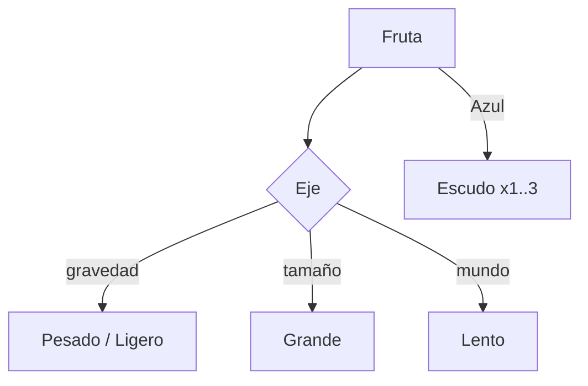

# Mecánicas de Flapo

Todas las reglas del juego, con sus constantes. Es la referencia de diseño del
port y refleja lo que hay implementado en `src/config/GameConfig.ts` y
`src/config/AirConfig.ts`.

## Bucle central

```
MENU → (jugar) → READY → (toque) → PLAYING
  → (colisión) → GAME_OVER → (otra vez) → READY
```

- **MENU**: el mundo se ve quieto detrás y elige cómo empezar.
- **READY**: Flapo flota sin gravedad. El primer toque arranca la partida **y da
  el impulso** del primer aleteo.
- **PLAYING**: gravedad, scroll, puntuación y muertes.
- **GAME_OVER**: el mundo se para, Flapo sigue cayendo y a los 0,5 s aparece el
  panel.

## Pantalla y mundo

| Constante | Valor |
| --- | --- |
| Tamaño lógico | 288×512 px |
| Alto del suelo | 64 px |
| Altura jugable | 448 px |
| Flapo | 24×24 px de dibujo, hitbox círculo radio 8 |
| Ancho de tubería | 26 px |
| Tile de suelo | 32 px |

El campo se dibuja a 288 px de ancho lógicos. En ventanas altas el alto lógico
crece (`viewH > 512`): la banda jugable queda centrada y el alto extra se
reparte entre cielo (arriba) y suelo (abajo), así que nunca hay franjas muertas.

## Física de Flapo

| Constante | Valor |
| --- | --- |
| Gravedad | 1200 px/s² |
| Impulso de aleteo | −380 px/s |
| Tope de caída | 500 px/s |
| Techo | y = 0 |
| Muerte por vacío | y = 512 |
| Rebote al morir | −180 px/s |
| Giro de aturdimiento | 9 rad/s |

La física corre a 60 Hz fijos. La rotación se interpola exponencialmente hacia un
ángulo objetivo que depende de la velocidad vertical (morro arriba al subir,
picado al caer), de −25° a 90°.

## Aliento y planeo

El mismo botón hace dos cosas:

- **Toque corto** → aleteo, impulso fijo.
- **Mantener** (≥ 0,18 s) → planeo: gravedad ×0,25 y tope de 90 px/s.

| Constante | Valor |
| --- | --- |
| `MAX_BREATH` | 100 |
| `BREATH_DRAIN_FLAP` | 10 por aleteo |
| `BREATH_DRAIN_GLIDE` | 15 / s |
| `BREATH_RECOVER_ON_GAP` | +25 por hueco centrado |
| `BREATH_BAND_RATIO` | 0,5 (mitad central) |
| `GLIDE_HOLD_TIME` | 0,18 s |
| `GLIDE_GRAVITY_MULT` | 0,25 |
| `GLIDE_MAX_FALL_SPEED` | 90 px/s |

**A 0 de aliento el planeo deja de frenar, pero el aleteo sigue funcionando
siempre.** El castigo es perder una herramienta, nunca el control.

La **confianza** alarga el aliento máximo: +8 por cada 10 partidas jugadas, con
tope en el escalón 5 (100 → 140).

## Fatiga

| Constante | Valor |
| --- | --- |
| `FATIGUE_FLAP_COUNT` | 4 aleteos |
| `FATIGUE_WINDOW` | 1,2 s |
| `FATIGUE_PENALTY` | 30 % |

Más de 4 aleteos en 1,2 s reducen el impulso del siguiente un 30 %. Se quita
planeando una vez o dejando pasar la ventana. El ritmo normal (3,4 aleteos por
hueco en el tope) nunca fatiga: solo machaca quien quiere.

## Jadeo visible

Por debajo del 30 % del aliento: aleteo ×1,6, mejillas encendidas (tinte
continuo hasta 0,55) y partículas de sudor. A 0, además, vaho. Todo se deriva del
aliento, no hay estado que reiniciar.

## Frutas

Aparecen flotando entre tuberías, a `chance` 0,6, en la franja central. Duran 6 s.

| Fruta | Efecto | Puntos |
| --- | --- | --- |
| Azul | Inmunidad a un toque (escudo) | — |
| Verde | Gravedad ×0,5 | — |
| Violeta | Velocidad del mundo ×0,6 | — |
| Roja | Gravedad ×2 | +3 |
| Naranja | Dibujo ×2, hitbox ×1,6 | +3 |

Reglas de composición:

- **Un efecto por eje** (gravedad, tamaño, mundo); los ejes distintos conviven.
  Roja y verde comparten eje, así que se sustituyen.
- El **escudo se apila hasta 3** y no caduca. Cada golpe gasta uno.
- La naranja solo aparece si el hueco actual ≥ 90 px, para que sea justa.



## Curva de dificultad

Funciones puras de la puntuación con tope a los 30 puntos. Los tres modos
escalan el hueco y la velocidad con proporciones distintas, pero la separación
escala con la velocidad, así que **los aleteos entre tuberías son los mismos en
todos los modos**.

| Puntos | Velocidad | Hueco | Separación | Aleteos |
| --- | --- | --- | --- | --- |
| 0 | 100 px/s | 118 px | 160 px | 4,57 |
| 15 | 122 px/s | 100 px | 166 px | 3,87 |
| 30+ | 145 px/s | 82 px | 172 px | 3,39 |

| Modo | Hueco | Velocidad | Hueco a 0 | Hueco a 30 |
| --- | --- | --- | --- | --- |
| Fácil | ×1,18 | ×0,85 | 139 px | 97 px |
| Normal | ×1,0 | ×1,0 | 118 px | 82 px |
| Difícil | ×0,88 | ×1,15 | 104 px | 72 px |

## Tuberías

- **Normal**: hueco aleatorio centrado entre el 20 % y el 80 % de la altura
  jugable. +1 por cruzarla, una sola vez.
- **Recupera aliento** si cruzas por la mitad central del hueco; el compañero se
  asusta si pasas rozando (desvío ≥ 80 % del semihueco).
- **Móvil** (`≥ 15 pts`): probabilidad de 0,15 a 0,45; amplitud hasta ±22 px,
  periodo 2,4 s. La amplitud se recorta para que el hueco entero quepa.
- **Giratoria** (`≥ 12 pts`): probabilidad de 0,12 a 0,35; 0,35 vueltas/s. Solo
  giran las bocas: el hueco real no cambia.
- **Blandita** (una de cada 7): tinte verde. No mata; rebota hacia el centro del
  hueco y cuesta 35 de aliento y 1 punto, con 0,8 s de enfriamiento. Tocar a la
  vez una blandita y una normal sí mata.

## Tramo especial

Al superar el récord de la sesión (con récord ≥ 1): 4 tuberías móviles y
giratorias a la vez, la del medio blandita, con la dificultad congelada. Sale una
vez por partida.

## Ráfagas de viento

| Constante | Valor |
| --- | --- |
| Aviso | 2 s |
| Duración | 5 s |
| Calma | 12–22 s |
| Factor a favor | ×1,25 |
| Factor en contra | ×0,80 |
| Puntuación mínima | 10 |

El viento **nunca** saca la velocidad del sobre de la curva: si la dirección
pedida no cabe, sopla hacia la contraria. Siempre se anuncia antes.

## Escenarios y tramos del viaje

Cuatro escenarios cosméticos elegidos por la semilla (no consumen el generador):
día `#7CB3D7`, atardecer `#E8A06B`, noche `#2E3F5C`, lluvia `#8FA3B0`. Tiñen el
parallax y, en lluvia, caen gotas.

Cuatro tramos que cambian cada 13 puntos con un fundido de 2 s: **Parque →
Tejados → Nubes → Cielo**. El paisaje va contando lo lejos que llegas sin decir
un número.

## El nido (fin del viaje)

A los **50 puntos** las tuberías se pausan, Flapo flota 3 s y aparece la línea
*"Ha llegado. Gordo, pero ha llegado."*. La partida **continúa** después.

## Semilla, reto y código

- **Determinismo**: toda la aleatoriedad sale de un único `Rng` sembrado por
  partida. Misma semilla → misma secuencia de tuberías, en cualquier navegador.
- **Reto del día**: semilla = fecha local `AAAAMMDD`; marca en clave propia.
- **Código compartible**: 5 caracteres en base 36 (60 millones de partidas). La
  semilla libre se sortea dentro del espacio del código, así que el código es de
  ida y vuelta.
- **Fantasma**: graba la `y` de Flapo por frame y la reproduce si la semilla
  coincide. Guarda posiciones, no pulsaciones, para sobrevivir a cambios de
  constantes.

## Meta-progresión

| Concepto | Regla |
| --- | --- |
| Récord | Mejor puntuación, persistente |
| Medallas | Croqueta 10 · Tortilla 20 · Jamón 40 |
| Confianza | +8 aliento cada 10 partidas (máx. +40) |
| Modo espejo | Se desbloquea con récord 25 |
| Estadísticas | Partidas, mejor marca, medalla, tuberías totales y media |

## Composición de sonido y *juice*

- **Sonidos**: aleteo, punto, golpe, caída, botón, fruta buena/mala y bocanada.
- **Al morir**: flash blanco, sacudida de cámara, hit-stop de 80 ms y rebote.
- **Al arrancar**: fundido corto de 0,25 s.
- **Parallax**: dos capas (nubes ×0,15 y paisaje ×0,40).

## Fuera de alcance

Skins, ranking online, anuncios, compras, cuentas y servidor. Todo el juego es
offline y gratis.
